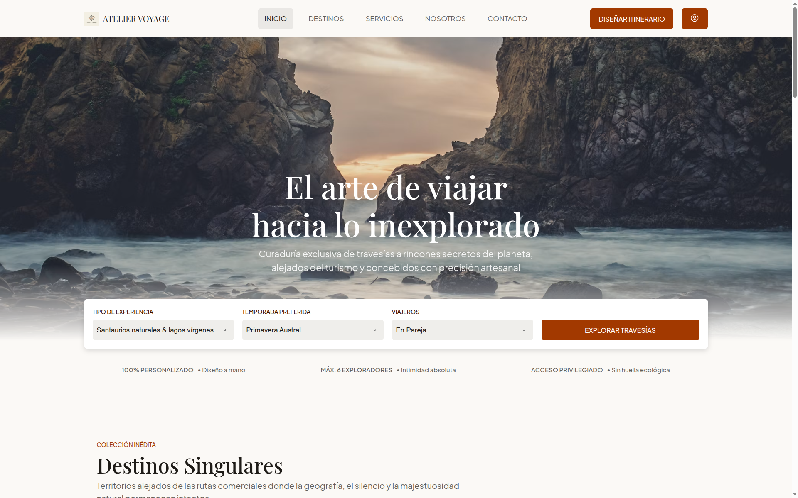
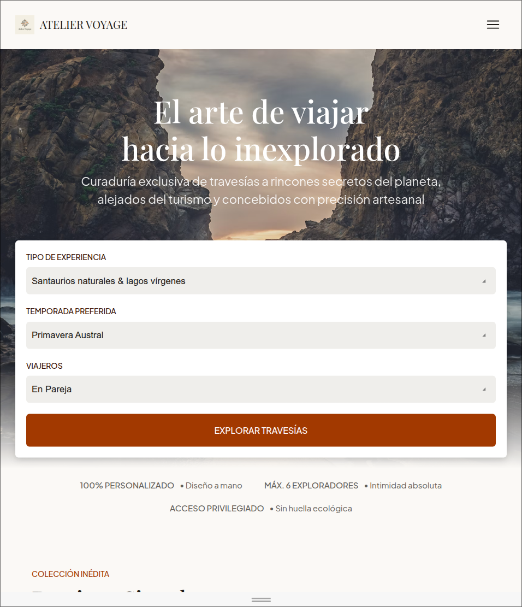
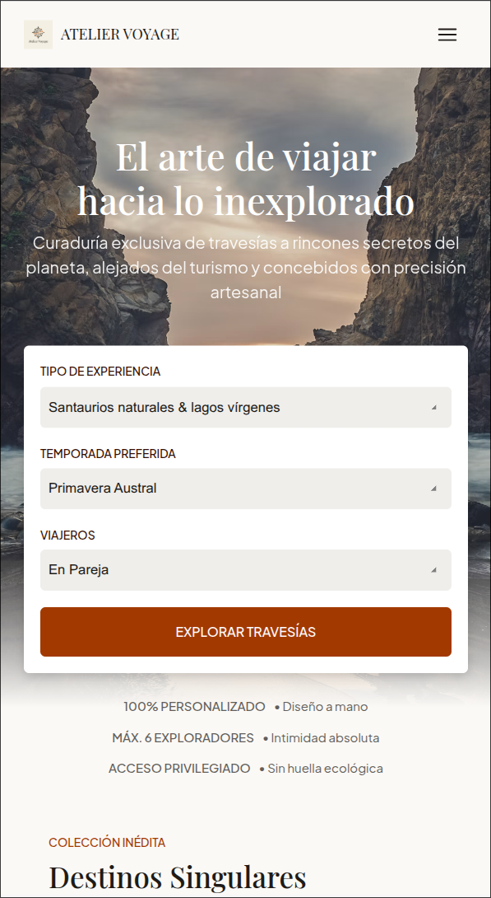

# Atelier Voyage | Software Development IV

Un diseño de `Stitch` transformado a un sitio web responsivo.

## Stich

**Prompt**:
```txt
Diseña la interfaz web para una agencia de viajes boutique y exclusiva especializada en destinos poco conocidos, originales y fuera de lo común.
Estilo y Estética:


Estilo claro, amplio y elegante (evitar aspecto de plataforma SaaS o software empresarial).

Fondo predominante en tonos claros u off-white con tipografía legible y refinada.

Color de acento: Naranja vibrante pero sofisticado para botones, llamados a la acción (CTA) y detalles clave.
Estructura e Integridad de Secciones:


Encabezado (Header): Logotipo elegante, menú de navegación horizontal (Inicio, Destinos, Servicios, Nosotros, Contacto) y un botón de acción rápida.

Sección Principal (Hero): Título impactante orientado a experiencias únicas e inexploradas, subtexto descriptivo, imagen de fondo en alta resolución de un destino exótico y un buscador o botón de exploración.

Sección de Servicios All-in-One: Cuadrícula o tarjetas limpias mostrando la cobertura integral de la agencia (itinerarios a medida, gestión completa de vuelos y hospedaje boutique, guías locales privados y soporte 24/7).

Sección Acerca de: Bloque con narrativa sobre la filosofía de viajes exclusivos y destinos poco convencionales con soporte de imagen descriptiva.

Formulario de Contacto: Formulario accesible y estilizado para solicitar información personalizada (Campos: Nombre, Correo electrónico, Destino de interés, Mensaje y Botón de envío).

Pie de Página (Footer): Enlaces secundarios, información de derechos reservados, redes sociales y contacto directo.
Requisito Responsivo: La propuesta debe contemplar una distribución adaptable para versión de escritorio, tableta y teléfono móvil.
```

- [Diseño de Stitch](https://stitch.withgoogle.com/projects/8449397855513137303)
## Vistas

### Computadora



### Tableta



### Teléfono



## Preguntas de reflexión

**1. ¿Qué partes del diseño de Stitch logró implementar?**

Se incorporaron todas las secciones del diseño de Stich.

**2. ¿Qué cambios realizó y por qué?**

La imagen de la sección `Hero` contaban con una calidad inferior a la deseada, por lo que se optó por utilizar una imagen de [Unsplash](https://unsplash.com)

Los íconos propuestos en el diseño de Stitch requieren de una librería externa. Por simplicidad, se omitieron los mismos.

**3. ¿Qué etiquetas semánticas utilizó?**

Se evita el uso de `<div>` para la mayoría de las secciones. En su lugar, se utiliza `<section>`, `<header>`, `<footer>`, `<ul>`, `<article>`, entre otras.

**4. ¿Qué medidas de accesibilidad incorporó?**

La fuente utilizara en la raíz del proyecto corresponde a `16px`, un buen balance entre legibilidad y estética.

Además, los elementos accionables (clickeables), utilizan la etiqueta `<button>` asegurando el acceso a usuarios de teclado.

La paleta de colores mantiene un contraste correcto en los fondos y el color de texto.

También, las imágenes cuentan con el atributo `alt`. Los usuarios podrán utilizar el lector para obtener una descripción de cada imagen.

**5. ¿Qué cambios se producen mediante las media queries?**

Las media queries introducen comportamiento dentro de un rango específico del `viewport`. De esta forma, nos aseguramos el correcto funcionamiento y aspecto visual de nuestro sitio web en diferentes dispositivos.

**6. ¿Cuál fue la principal dificultad encontrada?**

La principal dificultad fue encontrar los elementos semánticos correctos para cada sección en el diseño de Stitch.
